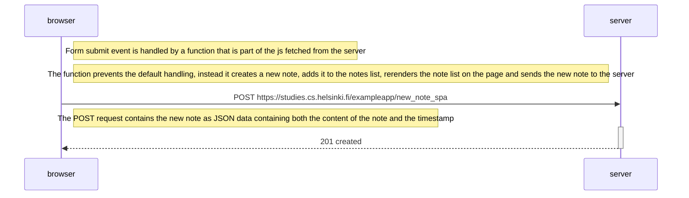

```mermaid
sequenceDiagram
    participant browser
    participant server

    Note right of browser: Form submit event is handled by a function that is part of the js fetched from the server 
    Note right of browser: The function prevents the default handling, instead it creates a new note, adds it to the notes list, rerenders the note list on the page and sends the new note to the server
    browser->>server: POST https://studies.cs.helsinki.fi/exampleapp/new_note_spa
    Note right of browser: The POST request contains the new note as JSON data containing both the content of the note and the timestamp
    activate server
    server-->>browser: 201 created
    deactivate server
```
